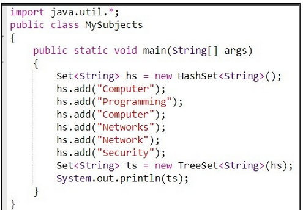

### Preguntas sobre Colecciones y Generics

### 1) ¿Qué característica es verdadera acerca de LinkedList en Java?

1. LinkedList es una implementación de List que usa un array dinámico.
2. LinkedList permite operaciones de inserción y eliminación en ambos extremos con eficiencia constante.
3. LinkedList no permite elementos duplicados.
4. LinkedList es una colección sincronizada.

R/ 2.

### 2) ¿Cuál es el resultado del siguiente fragmento de código?

```java
List<String> fruits = new ArrayList<>();
fruits.add("Apple");
fruits.add("Banana");
fruits.add("Cherry");

for (String fruit : fruits) {
    if (fruit.equals("Banana")) {
        fruits.add("Date");
    }
}
System.out.println(fruits.size());
```

a) 3
b) 4
c) Error
d) null

R-/ C. Error porque modifica la lista que se esta recorriendo con un Iterator (foreach utiliza iterator por debajo).

3. ¿Cuál es el resultado del siguiente fragmento de código?

```java
List<Integer> numbers = new ArrayList<>();
numbers.add(1);
numbers.add(2);
numbers.add(3);

for (Integer number : numbers) {
    if (number == 2) {
        numbers.remove(number);
    }
}
System.out.println(numbers.size());
```

a) 3
b) 2
c) Error
d) null

R-/ Error porque modifica directamente la lista que se esta recorriendo con un iterator.

4. ¿Cuál es el resultado del siguiente fragmento de código?

```java
Map<String, Integer> map = new HashMap<>();
map.put("A", 1);
map.put("B", 2);
map.put("C", 3);

map.remove("B");
map.put("D", 4);

System.out.println(map.get("A"));
System.out.println(map.get("B"));
```

a) 1, null, 3
b) 1, 2, 3
c) 1, 4, 3
d) 4, null, 3

R-/ 1, null. No imprime otro numero porque solo hay dos operaciones de salida. Pregunta incompleta y mal planteada.

### Preguntas sobre Colecciones

1. ¿Cuál de las siguientes es una interfaz en Java Collections Framework?

a) ArrayList
b) LinkedList
c) HashSet
d) ListIterator

R-/ D. ListIterator

2. ¿Cuál de las siguientes afirmaciones sobre Set es verdadera?

   A. Un HashSet no puede tener un valor nulo.

   B. El conjunto permite valores duplicados.

   C. El conjunto permite valores nulos pero solo una sola aparición.

   D. Set extiende de la interfaz java.util.Collection.

R-/ D Y C.

3. Dada la siguiente imagen responda:



A. [Computer, Network, Networks, Programming, Security]
B. [Computer, Programming, Network, Networks, Programming, Security]
C. [Computer, Programming, Computer, Networks, Network, Security]
D. [Computer, Networks, Network, Programming, Security]

R-/ D, no asegura el orden en hashset.

4. No contiene elementos duplicados, los elementos no son pares clave-valor, acceder a un elemento puede ser casi tan rápido como realizar una operación similar en un arreglo.

A. LinkedList

B. TreeMap

C. HashSet

D. LinkedHashMap

E. HashMap

R-/ HashSet.
No contiene elementos duplicados (set), los elementos no son pares clave-valor (se descartan los map).

5. ¿Cuál(es) de estas interfaces permite elementos duplicados?

   Set <- np permite.

   List <-- Permite

   Hash <-- (No es una interfaz, ni una clase, las clases de Collection Framework que comienzan por Hash no implementan una interfaz como tal sino que la logica de la clase es Hash, entonces quien sabe.)

   Array <-- (SI permite duplicados pero no es interfaz, ni una clase, quien sabe.)

### Preguntas sobre Colecciones y Generics (extra)

1. ¿Cuál de las siguientes afirmaciones es verdadera sobre HashMap en Java?

a) HashMap permite claves nulas y valores nulos.
b) HashMap es una colección sincronizada.
c) HashMap mantiene el orden de inserción de sus elementos.
d) HashMap permite claves nulas y valores no nulos.

R-/ A. (Solo permite una clave null, si se vuelve agregar un par clave:valor con la clave `null`, el nuevo sobreescribe al que ya estaba.)

2. ¿Cuál es el resultado del siguiente fragmento de código?

```java
Map<String, Integer> ages = new HashMap<>();
ages.put("John", 25);
ages.put("Emma", 30);
ages.put("Michael", 35);
ages.remove("John");

System.out.println(ages.containsKey(Emma));
```

a) true
b) null
c) Error de compilación
d) 30

R-/ ERROR, la clave `Emma` en `ages.containstKey` esta sin comillas.

3. ¿Cuál es el resultado del siguiente fragmento de código?

```java
List<String> colors = new ArrayList<>();
colors.add("Red");
colors.add("Green");
colors.add("Blue");

for (String color : colors) {
  if (color.equals("Green")) {
    colors.remove(color);
  }
}
System.out.println(colors.size());
```

a) 3
b) 2
c) Error
d) null

R-/ Error porque foreach utiliza Iterator por debajo. Y no se puede modificar la lista directamente si se utiliza Iterator. <-- En general es asi, pero si probamos el codigo no tira error ?? En general, cuando se modifica directamente una Lista en un foreach (la lista que iteramos), este nos tira una excepcion (error).

4. ¿Cuál es el resultado del siguiente fragmento de código?

```java
Queue<Integer> queue = new LinkedList<>();
queue.add(10);
queue.add(20);
queue.add(30);

System.out.println(queue.poll());
System.out.println(queue.peek());
System.out.println(queue.size());
```

a) 10, 20, 2
b) 10, 20, 3
c) 10, 30, 3
d) 10, null, 2

R-/ A

### Enunciados

4.  Crear una clase genérica Camión que contenga una linkedList de Canastas cada canasta tiene código y peso, realizar en la clase tienda un método que retorne las canastas con peso menor a 20 usando iteradores. [En.](./camion/Main.java)

5.  Implementar un método genérico que reciba dos listas de cualquier tipo(List) y devuelva una nueva LinkedList con la unión de ambas listas, eliminando los elementos duplicados. Usa las clases e interfaces de java.util.Collections(no se pueden usar ciclos, ni recursividad). [En.](./juntar/Main.java)

6.  Crear una clase genérica Cola<T> con un tamaño máximo. Al intentar agregar más elementos de los permitidos, se debe lanzar una excepción IllegalStateException. [En.](./cola/Main.java)

7.  Implementar un método genérico que reciba una lista de elementos comparables y devuelva el máximo elemento en dicha lista. Usa la interfaz Comparable<T> para asegurar que los elementos puedan ser comparados(no usar ciclos ni recursividad). [En.](./comparablesII/Main.java)

---

:)
